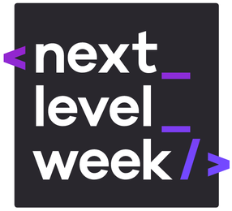
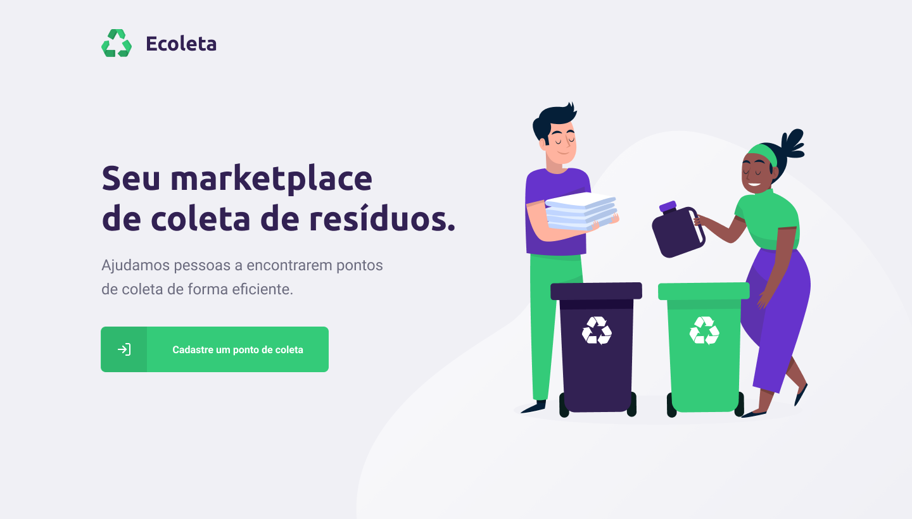

# :rocket: NextLevelWeek 1.0 

## **"O NLW é uma experiência online com muito conteúdo prático, desafios e hacks que vão te ajudar avançar para o próximo nível."**

<p align="center">
  
</p>

Oferecido por: **[Rocketseat](https://www.rocketseat.com.br)**

# :computer: Tecnologias

## API
* [Node.JS](https://nodejs.org/en/docs/)
* [Express](https://expressjs.com/)
* [TypeScript](https://www.typescriptlang.org/)
* [SQLite](https://www.sqlite.org/index.html)
* [Knex](http://knexjs.org/)
* [Multer](https://www.npmjs.com/package/multer)
* [Cors](https://github.com/expressjs/cors)

## Web
* [ReactJS](https://reactjs.org/)
* [TypeScript](https://www.typescriptlang.org/)
* [Leaflet](https://leafletjs.com/)
* [ReactDropzone](https://react-dropzone.js.org/)
* [Axios](https://github.com/axios/axios)

## Mobile
* [React Native](https://reactnative.dev/)
* [Expo](https://docs.expo.io/)
* [Axios](https://github.com/axios/axios)
* [Mail Composer](https://docs.expo.io/versions/latest/sdk/mail-composer/)
* [Map View](https://docs.expo.io/versions/latest/sdk/map-view/)

<br/>

# :green_book: O repositório
"Faaaaaala dev!"
Bom... O objetivo deste arquivo é anotar informações importantes destacadas durante o andamento das aulas. O arquivo será distribuído nos canais de aprendizado com o intuito de auxiliar devs após o fechamento das aulas, para que você possa continuar codando e desenvolvendo projetos Node.JS (pensando na experiência própria de esquecer diversas configurações, comandos ou conceitos semanas depois de uma semana omnistack), até o momento em que esteja tudo na memória. Algo totalmente pensado de dev para dev, um pouco trabalhoso (uma aula de 2 horas acaba durando umas 5/6 horas, alias, também estou aprendendo e por isso suas contribuições e correções são extremamente valiosas), mas uma iniciativa para realmente ajudar e motivar a comunidade, feito com muito carinho. 

Para rodar a aplicação: 

## Instalando dependencias
```
$ npm install
```

## Api
```bash
$ npm run dev
# ou
$ yarn dev
```

## Web
```bash
$ npm start
``` 

## Mobile
```bash
$ npm start
# ou 
$ expo start
```

## SQLite
```
$ npm run nkex:migrate
$ npm run knex:seed
```

## Índice

* Day 1: Ambiente
* [Day 2](markdown/day2.md): API
* [Day 3](markdown/day3.md): Web
* [Day 4](markdown/day4.md): Mobile
* [Day 5](markdown/day5.md): Extras

## :bangbang: Chega de enrolação!
Não esqueça de configurar devidamente seu ambiente e vamos lá ;)

*Este conteúdo esta sendo desenvolvido com base nas aulas do modulo **Booster***

#### *Sinta-se livre para colaborar, toda ajuda é bem vinda ;)*
<br/>

# Day 1

## :camera: A aplicação

<p align="center">
  
</p>

A aplicação desenvolvida na NLW será um Marketplace de coleta de resíduos com o objetivo de ajudar pessoas a encontrarem pontos de coleta de forma eficiente

<p align="center">
  
</p>

Para visualizar a prototipação completa do projeto [clique aqui](https://www.figma.com/file/9TlOcj6l7D05fZhU12xWT3/Ecoleta-(Booster)?node-id=0%3A1)

## Iniciando o **Node.JS**
### Para iniciar um projeto node utilizar:
```bash
$ npm init -y
$ npm install express
```
<br/>

## Configurando e Utilizando **TypeScript**
### Tipagem para o *express*
```bash
$ npm install @types/express -D
```

**Obs:** "-D" para dependência de desenvolvimento! 

<br/>

### Instalando o TS
```bash
$ npm install ts-node -D
$ npm install typescript -D
```

<br/>

### Criando arquivo de configuração TS
```bash
$ npx tsc --init
```
<br/>

### Gerando JS
```bash
$ npx ts-node <dir>
```
<br/>

### Pacote para reiniciar o server automaticamente
```bash
$ npm install ts-node-dev -D
$ npx ts-node-dev <dir>
```
<br/>

## Configurando **ts-node-dev** no package.json
### Para reiniciar automaticamente o servidor ao salvar arquivos. 
Em *package.json*:
```json
"scripts": {
  "dev": "ts-node-dev <dir>"
}
```
```bash
$ npm run dev
# ou
$ yarn dev
```

<br/>

## Iniciando projeto React
```bash
$ npx create-react-app web --template=typescript
```

<br/>

### Recomendações:
- Whimsical: Aplicação web para criação de Fluxogramas

- Figma: Aplicação web para Prototipação / Wireframe

- Notion: To-do List
<br/>

**Obs:** Para iniciantes, recomendo também criar seu próprio repositorio no github, iniciando assim seu portfólio além de ser uma ótima maneira de começar a aprender sobre essa ferramenta!

Gostaria de agradecer o(a) [clowjs](https://github.com/clowjs) que fez algumas correções nos arquivos, mas por alguma razão todos commits foram perdidos (problema de bios talvez kk)

Ir para: [Day 2](markdown/day2.md)