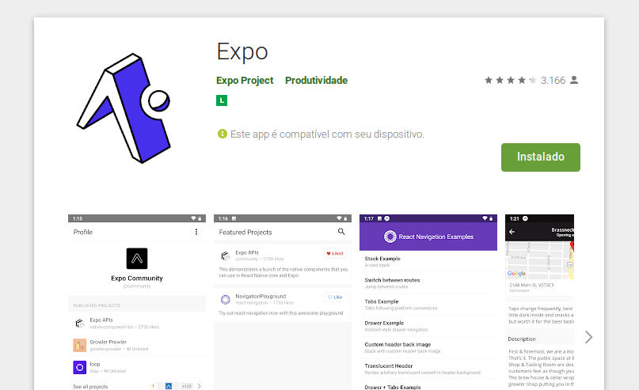
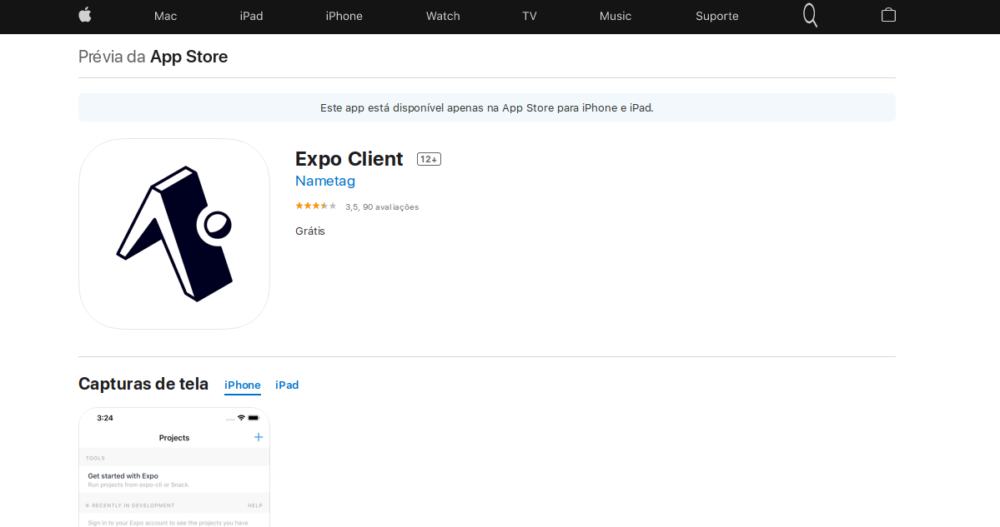

# :rocket: Day 4

Faaaaaaala dev (deu para ouvir ai?)


# :iphone: Criando nosso aplicação Mobile

## Recapitulando

Se você ainda não se adaptou totalmente a utilização do JavaScripto, volte para o [Day 3](day3.md) e revise alguns dos conceitos, e caso ja não esteja familiarizado, é hora de aprofundar suas pesquisas meu caro dev ;)

Em aulas anteriores também foi apresentado uma ferramenta chamada Expo que tem como um dos principais objetivos permitir que possamos testar nosso app no nosso smartphone, seja Android ou da querida maçã (cof cof!). Mas caso você não se lembre muito bem, não se preocupe, até então ela foi apenas citada, a partir de agora vamos utiliza-la na prática para montar nosso App **ECOLETA**!

!tips: **Ctrl+J** para abrir o terminal do VS Code!

<br/>

<br/>

## Configurando o Emulador

Para quem ja esta acostumado com smartphones o processo é bem simples, basta ir a loja de aplicativos do seu celular e baixar o Expo

### Android



### iOS



Para visualizar a sua aplicação basta acessar o aplicativo pelo celular e escanear o QRCode.

Caso você não possua um celular em condições para rodar o expo, [clique aqui](https://www.youtube.com/watch?v=eSjFDWYkdxM). Infelizmente não te enviaremos um celular novo... Maaaaaaaas a **Rocketseat** (conhece?) disponibilizou um tutorial de como emular para o PC ;)

Mas ja vamos avisando emulação de android ou ios vai consumir bastante da sua máquina e exigirá que você tenha um bom computador em mãos.

Por ultimo caso, se nenhuma dessas opções for viável a você, recomendamos o uso do [snack.expo.io](snack.expo.io). Nenhum soldado vai ficar para trás!

Em caso de duvidas acesse o repositório [Expo common issues](https://github.com/Rocketseat/expo-common-issues) também da Rocketseat.

## Instalando o EXPO e criando o projeto

Vamos instalar e inicializar o projeto *Expo*:
```bash
$ npm install -g expo-cli
# Ao finalizar, iremos iniciar nosso projeto ;) Obs -g instalara o expo de maneira global
$ expo init <nomeDoProjeto>
# Caso não tenha instalado globalmente a aplicação (como eu optei por fazer) utilize sempre com npx antes: $ npx expo init mobile
```

Após isso sera solicitado para a escolha do template, iremos optar por
> blank (TypeScript)    same as blank but with TypeScript configuration

## Inicializando o projeto
Basta digitar
```bash
$ npm start
```
Caso você tenha feito tudo corretamente meu caro dev, uma nova guia no browser se abrirá contendo as ferramentas de desenvolvimento do Expo ;)

## React-Native X ReactJS

- No React-Native todas as estruturas conhecidas do html (header, footer, aside, etc) são <View style={style.name}>
- Estilização em JSX (substituindo hífen por camelCase, ex: background-color -> backgroundColor)
- Display flex por padrão

O restante é tudo igual, basta reaproveitar os conceitos ja aprendidos!!!!!!!!!!!

## Adicionando fontes ao smartphone

Utilizaremos o Expo Google Fonts!
```bash
# Não utilize por enquanto
$ expo install expo-font
```

Neste projeto em especifico utilizaremos as mesmas fontes da nossa aplicação web (Roboto e Ubuntu):
```bash
$ expo install expo-font @expo-google-fonts/ubuntu @expo-google-fonts/roboto
```

**Obs:** Caso não tenha instalado o expo globalmente, basta iniciar o comando com *npx*

Para importar as fontes utilize:
```javascript
import { Roboto_400Regular, Roboto_500Medium } from '@expo-google-fonts/roboto';
import { Ubuntu_700Bold } from '@expo-google-fonts/ubuntu';
```

[Mais informações](https://github.com/expo/google-fonts)

## Rotas no React

Para isso utilizaremos o pacote *react-navigation*
```bash
$ npm install @react-navigation/native
```
```bash
$ expo install react-native-gesture-handler react-native-reanimated react-native-screens react-native-safe-area-context @react-native-community/masked-view
# ou
$ npx expo install react-native-gesture-handler react-native-reanimated react-native-screens react-native-safe-area-context @react-native-community/masked-view
```

Instale também o react-navigation stack e o constants
```bash
$ npm install @react-navigation/stack
$ expo isntall expo-constants
```

## Utilizando o **Maps**

```bash
$ expo install react-native-maps
```

Para utilizar a localização atual do usuário:
```bash
$ expo install expo-location
```

## Utilizando SVG

```bash
$ expo install react-native-svg
```

## Conectando com a API

Para conectar nossa aplicação mobile com api's externas utilizaremos também o AXIOS
```bash
$ npm install axios
```

## Botão de email

Para isso devemos utilizar o MailComposer
```bash
$ npm install expo-mail-composer
```

Ir para: [Day 5](day5.md)