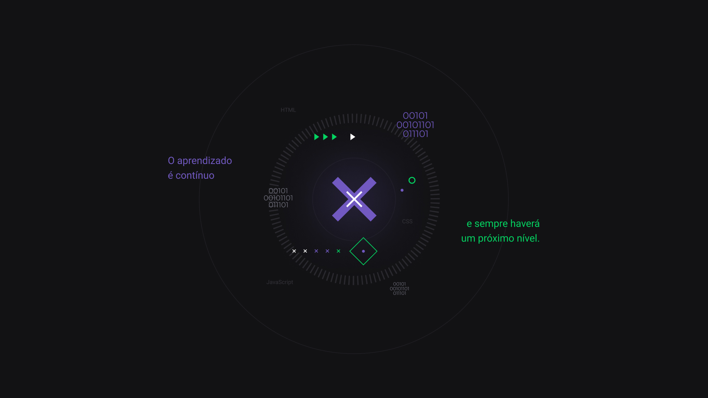

# Day 5

Faaaaaaala dev (deu para ouvir ai?)



# :mortar_board: O ultimo dia, a milha extra e Recursos Avançados

Infelizmente estamos chegando ao final da NLW devs, mas vamos ao que importa, as tasks do ultimo dia foram:

- Upload de imagem
  - Configurando back-end
  - Craindo dropzone no ReactJS
- Validação de entrada
- Adicionando no Github
- Deploy (Onde hospedar)
  - Back-end
    - Heroku
    - Digital Ocean
    - AWS
  - Front-end
    - Netlify / Vercel
    - Amazon S3 / Google Cloud Storage

<br/>

## Upload de imagem (Back-end)

```bash
$ npm install multer
$ npm install @types/multer-D
```

## Upload de imagem (Front-end)

```bash
$ npm install react-dropzone
```

## Validação de entrada (Back-end)

```bash
$ npm install celebrate
$ npm install @types/hapi__join -D
```

E chegamos ao fim pessoal! Este arquivo foi bem curto pois a aula teve uma pegada totalmente prática.

Devido a alguns problemas na máquina deixei algumas correções pendentes no código, mas que logo estarão 100% funcionais!

Um abraço e até a próxima NLW devs ;)